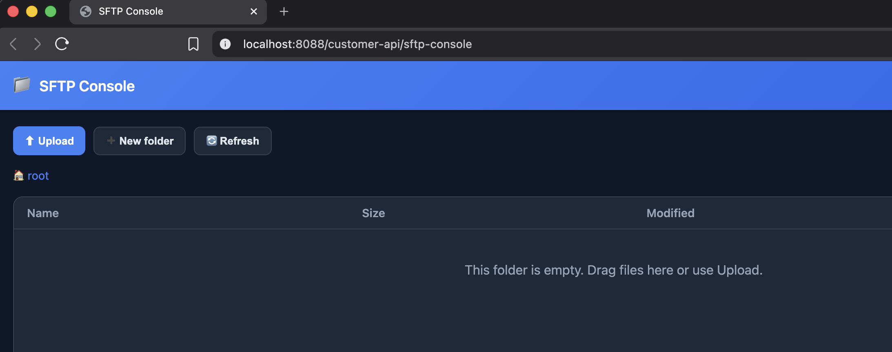

# sftp-console-spring-boot-starter

An in-memory SFTP server (powered by [Apache MINA SSHD](https://mina.apache.org/sshd-project/)
serving a [Google Jimfs](https://github.com/google/jimfs) heap filesystem) with a web
console, packaged as a Spring Boot auto-configuration starter. Drop it onto a local development
classpath to get a real SFTP endpoint — for testing file upload/download code — without Docker,
an external SFTP server, or a separate process. Everything runs embedded in the JVM and is
inspectable from a browser.

## Why I built this

I kept needing a real SFTP endpoint while developing — to test code that uploads and
downloads files — but the usual options were awkward: spin up a Docker container, run a
separate SFTP server, or (worst of all) push test files to a shared online server. I wanted
something a whole team could use during development with zero setup: an SFTP server that
lives inside the app's own JVM, keeps its files only in memory, and lets you see and manage
those files from a browser. No Docker, no external process, nothing sensitive leaving the
machine. That's what this starter is.

## Features

- File browser UI with breadcrumb navigation
- Upload via drag-and-drop or file picker
- Download any file
- Inline preview of text and images
- Create folder, rename, and delete (files and folders)
- Live refresh — files your app pushes over SFTP appear automatically
- Light/dark theme toggle, remembered across visits
- Off by default; enabled with a single property
- Files live in the JVM heap (Jimfs) and are cleared on restart
- No Docker and no external process

## Screenshots

Note: I have added the dependency on another project just to show you the UI of the SFTP console.



## Why not Testcontainers / a Docker SFTP image?

Testcontainers with an SFTP image is the usual way to get an SFTP endpoint in tests. This
starter targets a different sweet spot:

| | This starter | Testcontainers SFTP image |
|---|---|---|
| **Docker daemon** | Not required | Required |
| **Startup** | Milliseconds (in-JVM) | Seconds (pull + container boot) |
| **Where files live** | JVM heap (Jimfs) | Container filesystem |
| **Inspect files** | Browser console, live | `docker exec` / volume mounts |
| **CI without Docker** | Works | Needs Docker-in-Docker or a daemon |
| **Fidelity to a real server** | Real SSH/SFTP protocol, simplified backend | Full real server |

Use Testcontainers when you need maximum fidelity to a production SFTP server. Use this
starter when you want a fast, zero-infrastructure SFTP endpoint you can *see into* while
developing — no daemon, no image pull, no separate process.

## Do I need to run anything separately?

**No.** The SFTP server and the web console run **embedded inside your application's JVM** and
start automatically when the console is enabled. Just open the console URL in a browser.

## Installation (one-time, per machine)

This starter is **not published to a Maven repository yet** — build and install it into your
local Maven repository (`~/.m2`) once:

```bash
git clone https://github.com/pmoustopoulos/sftp-console-spring-boot-starter.git
cd sftp-console-spring-boot-starter
mvn clean install
```

Re-run `mvn clean install` whenever you change the starter's code. (Requires Java 17 or later.)

## Usage

**1.** Add the dependency:

```xml
<dependency>
  <groupId>io.github.pmoustopoulos</groupId>
  <artifactId>sftp-console-spring-boot-starter</artifactId>
  <version>0.1.0</version>
</dependency>
```

**2.** Enable it in a development profile and point your SFTP client at the embedded server —
`application.yml`:

```yaml
sftp:
  console:
    enabled: true
    port: 2222
    username: user
    password: password
    max-upload-size: 15MB # 10MB is the default value 
```

**3.** Start your application. The console URL and SFTP endpoint are logged at startup:

```
----------------------------------------------------------------
  SFTP console:        http://localhost:8080/sftp-console
  In-memory SFTP:      localhost:2222  (user / password)
----------------------------------------------------------------
```

Open the console URL in a browser to inspect and manage files. Your app (or a tool like
FileZilla) connects over SFTP to `localhost:2222` with the configured credentials.

## Configuration properties

| Property | Default | Description |
|---|---|---|
| `sftp.console.enabled` | `false` | Master switch. The SFTP server, console UI, and API only register when `true`. |
| `sftp.console.port` | `2222` | Port the embedded SFTP server listens on. |
| `sftp.console.host` | `localhost` | Network interface the embedded SFTP server binds to (localhost by default so it isn't exposed on all interfaces). |
| `sftp.console.username` | `user` | SFTP username clients authenticate with. |
| `sftp.console.password` | `password` | SFTP password clients authenticate with. |
| `sftp.console.accept-any-credentials` | `false` | When `true`, accept any username/password. |
| `sftp.console.path` | `/sftp-console` | Base path the console UI and its REST API are served under. |
| `sftp.console.max-upload-size` | `10MB` | Max size of a file uploaded through the console (e.g. `50MB`). Raises Spring's multipart limit while the console is enabled; override here, or with the standard `spring.servlet.multipart.*` settings. |
| `sftp.console.max-preview-size` | `1MB` | Max size of text shown inline in the preview; larger text files are truncated. Images and PDFs preview in full. |
| `sftp.console.refresh-interval` | `4s` | How often the console UI auto-refreshes the current folder. Set to `0s` to disable auto-refresh. |

## ⚠️ Development only

**Never enable this starter in production.** Only turn it on under a dedicated local/dev profile.

**Security interaction to be aware of:** when enabled (and Spring Security is on the classpath),
this starter registers its own `SecurityFilterChain`, scoped to the console path
(`sftp.console.path` + `/**`), at `@Order(HIGHEST_PRECEDENCE)`, with `permitAll()` and CSRF
disabled — so the console itself is intentionally open.

Spring Boot's default security auto-configuration backs off as soon as **any**
`SecurityFilterChain` bean exists. If your application relies entirely on Boot's default security
(defines no `SecurityFilterChain` of its own), enabling this console becomes the *only* chain,
leaving every other path unsecured. **If you rely on Boot's default security, define your own
`SecurityFilterChain` covering the rest of your application before enabling this console.**
Applications that already define their own security configuration are unaffected.

The embedded SFTP server also generates a fresh in-memory host key on each start (no persisted
key), which is appropriate for development only.

## License

Licensed under the [Apache License, Version 2.0](LICENSE).

This project depends on, but does not include the source of, third-party libraries that remain
under their own licenses — notably Apache MINA SSHD and Spring Boot (Apache 2.0) and Jimfs
(Apache 2.0). It is an independent wrapper and is not affiliated with or endorsed by those projects.

## Acknowledgments

- Powered by [Apache MINA SSHD](https://mina.apache.org/sshd-project/),
  [Google Jimfs](https://github.com/google/jimfs), and [Spring Boot](https://spring.io/projects/spring-boot).
